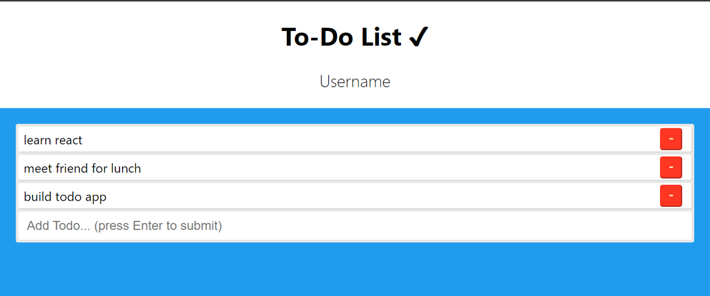

<div align="center" id="top"> 
  
  &#xa0;
</div>

<h1 align="center">To-Do List</h1>

<p align="center">
  

  

  

  
</p>

<p align="center">
  <a href="#dart-description">Description</a> &#xa0; | &#xa0; 
  <a href="#sparkles-roadmap">Roadmap</a> &#xa0; | &#xa0;
  <a href="#white_check_mark-requirements">Requirements</a> &#xa0; | &#xa0;
  <a href="#checkered_flag-starting">Starting</a> &#xa0; | &#xa0;
  <a href="#wrench-support">Support</a> &#xa0; | &#xa0;
  <a href="#memo-license">License</a> &#xa0; | &#xa0;
  <a href="https://github.com/AlexisCastro12" target="_blank">Author</a>
</p>

<br>

## :dart: Description

To-Do List is an application where <!--the basic front-end languages (HTML, CSS and JS) interact to create a fun interface that responds to the movement of the pointer in the browser.-->

<!--The project is made up of a pair of eyes that constantly pay attention to a bee's position and as it gets closer to them, the color of the skin changes to reddish when the bee is at the closest point.-->

## :sparkles: Roadmap

The characteristics that this project currently has are:

:heavy_check_mark: The pointer is a bee.

The main objective of this project is <!-- to learn how to manipulate the DOM of a web application. Also, its purpose is to handle events such as the movement of the pointer on the browser window. In the first instance, the application has fulfilled its objective, however, it is still possible to make improvements to complement it, such as:-->

:pushpin: Allow the user to switch from the pointer image.

## :white_check_mark: Requirements

Before starting :checkered_flag:, you need to have [Git](https://git-scm.com) installed.

## :checkered_flag: Starting

```bash
# Clone this project
$ git clone https://github.com/AlexisCastro12/ToDo-List.git

```

<!--Find the folder in the path where the clone was made and open the './index.html' file in any browser (Chrome recommended).

Initially the eyes are centered, just slide the pointer along the browser window and it will change the background color. Also, the proximity of the bee will be indicated in the banner in the upper left corner-->

## :wrench: Support

If you have problems with the project or need additional information, please contact me at <alexis1204.aacs@gmail.com> :e-mail:.

## :memo: License

This project is under license from MIT. For more details, see the [LICENSE](LICENSE) file.

Made with :heart: by <a href="https://github.com/AlexisCastro12" target="_blank">AlexisCastro12</a>

&#xa0;

<a href="#top">Back to top</a>
